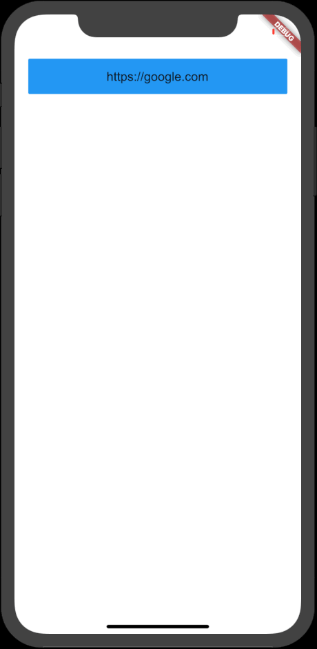

# flutter_webviews

Presenting a web view is pretty common in mobile apps. In Flutter, this is done by using the [`webview_flutter`](https://pub.dartlang.org/packages/webview_flutter) package. This package is part of a larger Github repository [github.com/flutter/plugins](https://github.com/flutter/plugins) which serves as a "companion repo to the main flutter repo. It contains the source code for Flutter first-party plugins (i.e., plugins developed by the core Flutter team)."

This tutorial, will be pretty simple, we'll:

* Create a basic app, with a single home screen, with a simple button to open a URL.
* Create our own widget that will present a web page in a full screen. 
* Cover some "gotchas" when working with web views.

## Fancy a Video?

Note, the video version of this post can be found at my "Flutter in 10 Minutes" video series here at [fluttercrashcourse.com](https://fluttercrashcourse.com/courses/flutter-ten-minutes) or my YouTube channel [here](https://www.youtube.com/channel/UCRCpzcQz-t2ueVihCIx5jDg). 

## Demo



## How the `WebView` Widget Works

On iOS the WebView widget is backed by a WKWebView, the newer and now official UIKit control for displaying web views. On Android the WebView widget is backed by a WebView.

## Step 1 of 3: Creating our Home Screen

### Generating Our Project and `main.dart`

Generate a new Flutter project via the Flutter command line tool via: `flutter create flutter_webviews`. Open the generated project and replace `main.dart` file with the following:

```dart
// main.dart

import 'package:flutter/material.dart';
import 'app.dart';

void main() => runApp(App());
```

### `app.dart`

Next, create a file called `app.dart`, which will contain some basic Material Design styling. It will also  set our app's `home` navigation route to a new widget we'll create next called `Home`:

```dart
// app.dart

import 'package:flutter/material.dart';
import 'screens/home.dart';

class App extends StatelessWidget {
  @override
  Widget build(BuildContext context) {
    return MaterialApp(
      title: 'Flutter Web Views',
      theme: ThemeData(
          primarySwatch: Colors.blue,
          fontFamily: "Arial",
          textTheme: TextTheme(
              button: TextStyle(color: Colors.white, fontSize: 18.0),
              title: TextStyle(color: Colors.red))),
      home: Home(),
    );
  }
}
```

## Step 2 of 3: Creating `home.dart`

Our `Home` screen will show a single button that opens a URL. In this example, we'll use standard Material Design widgets too keep things simple. The screen may contain a few widgets you may not be familiar with, but the import part is understanding the `_handleURLButtonPress` below, which will navigate to our web view, presented by a custom widget we'll create next called `WebViewContainer`:

```dart
// screens/home.dart

import 'package:flutter/material.dart';
import 'web_view_container.dart';

class Home extends StatelessWidget {
  final _links = ['https://google.com'];

  @override
  Widget build(BuildContext context) {
    return Scaffold(
        body: SafeArea(
            child: SingleChildScrollView(
                child: Column(
      mainAxisAlignment: MainAxisAlignment.center,
      crossAxisAlignment: CrossAxisAlignment.stretch,
      children: _links.map((link) => _urlButton(context, link)).toList(),
    ))));
  }

  Widget _urlButton(BuildContext context, String url) {
    return Container(
        padding: EdgeInsets.all(20.0),
        child: FlatButton(
          color: Theme.of(context).primaryColor,
          padding: const EdgeInsets.symmetric(horizontal: 50.0, vertical: 15.0),
          child: Text(url),
          onPressed: () => _handleURLButtonPress(context, url),
        ));
  }

  void _handleURLButtonPress(BuildContext context, String url) {
    Navigator.push(context,
        MaterialPageRoute(builder: (context) => WebViewContainer(url)));
  }
}
```

## Step 3 of 3: Presenting Our `WebView`

Our `WebView` widget will be present in a full screen, implemented by a new widget we'll create called `WebViewContainer`. The widget is a simple screen. 

The key takeaway for this screen is the `WebView` widget, availble to us by importing the `webview_flutter` package:

```dart
WebView(
    key: _key,
    javascriptMode: JavascriptMode.unrestricted,
    initialUrl: _url)
```

First, the `key` parameter allows the Flutter widget tree to refer to this widget easily using a unique key created via Flutter's `UniqueKey()` method you'll soon see in the full example below.

`javascriptMode` simply allows us to control what kind of Javascript can be run in our web view.

Finally, `initialUrl` is the URL we want to display.

### Implementing Our `WebViewContainer`

And finally, here's the code for our web view screen:

```dart
import 'package:flutter/material.dart';
import 'package:webview_flutter/webview_flutter.dart';

class WebViewContainer extends StatefulWidget {
  final url;

  WebViewContainer(this.url);

  @override
  createState() => _WebViewContainerState(this.url);
}

class _WebViewContainerState extends State<WebViewContainer> {
  var _url;
  final _key = UniqueKey();

  _WebViewContainerState(this._url);

  @override
  Widget build(BuildContext context) {
    return Scaffold(
        appBar: AppBar(),
        body: Column(
          children: [
            Expanded(
                child: WebView(
                    key: _key,
                    javascriptMode: JavascriptMode.unrestricted,
                    initialUrl: _url))
          ],
        ));
  }
}
```

The important gotcha here is that we'll need to use a `StatefulWidget` because it appears that if we use a `StatelessWidget`, the `WebView` will not load properly. 

We pass in a `url` parameter to this widget, which is used in the state of our `StatefulWidget`. 

There are additional features of the `WebView` widget, offering abilities such as detecting various gestures on the web page as well as callbacks so we can be notified when the web page is created. Feel free to Ctrl/Command + Click into the `WebView` widget to read up on more of those features.

### One More Requirement for iOS Devices

To use `WebView` on iOS, it's required to add an special setting in our `XCode` project. If you're not familiar with iOS projects, every project as a special file called `Info.plist`, which is a simple list of configuration settings. We can edit this file by opening `<project root>/ios/Runner/Info.plist` and adding the following to the file's `<dict>` element:

```xml
<dict>
    ...
    <key>io.flutter.embedded_views_preview</key>
    <string>YES</string>
    ...
```

For example, the start of the file will look like this:

```xml
<?xml version="1.0" encoding="UTF-8"?>
<!DOCTYPE plist PUBLIC "-//Apple//DTD PLIST 1.0//EN" "http://www.apple.com/DTDs/PropertyList-1.0.dtd">
<plist version="1.0">
<dict>
	<key>io.flutter.embedded_views_preview</key>
	<string>YES</string>
	<key>CFBundleDevelopmentRegion</key>
	<string>en</string>
	<key>CFBundleExecutable</key>
	<string>$(EXECUTABLE_NAME)</string>
    ...
```

## Conclusion

`WebView` provides us an easy way to render web pages in our app. Once you start using the Flutter plugin, it'll become easy to try other cool plugins listed on the Github repo [here](https://github.com/flutter/plugins). 

Happy Fluttering,
Nick

## Further Reading

- The [webview_flutter](https://pub.dartlang.org/packages/webview_flutter) package.
- [RaisedButton](https://docs.flutter.io/flutter/material/RaisedButton-class.html)
- [Cool post about RaisedButton](https://flutterdoc.com/widgets-raised-button-9c1c7f335b1f)